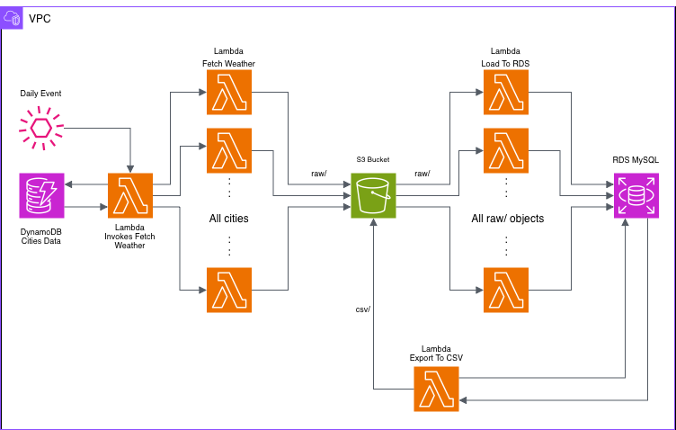
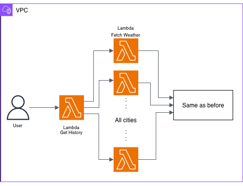
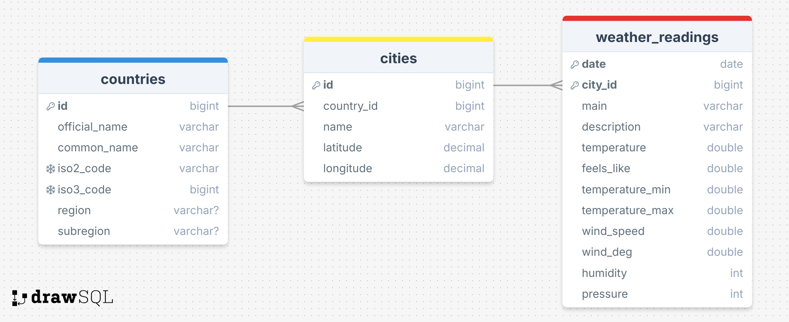

# WeatherDataPipeline
**Fully Serverless · AWS Lambda · DynamoDB · S3 · RDS MySQL · Terraform Infrastructure**

This project implements a production-grade, fully serverless ETL pipeline that collects weather data for multiple cities, stores raw files in S3, transforms & loads the data into a relational database, and allows CSV data exports for analytics.

All AWS resources (compute, networking, storage, permissions) are deployed using Terraform, ensuring full reproducibility and clean infrastructure-as-code.
<p align="center">
  
</p>


## Overview
This project implements a complete serverless ETL system on AWS:
1. DynamoDB stores a list of active city IDs.
2. A Lambda function (Invoker) reads DynamoDB and triggers one Lambda per city.
3. Fetch Weather Lambda requests current weather data from OpenWeather API and stores raw JSON in S3.
4. S3 triggers the Load-to-RDS Lambda, which:
   - inserts the country
   - inserts the city
   - inserts the weather reading
5. Get History Lambda can fetch historical weather data and write it to S3.
6. A separate Export to CSV Lambda generates CSV files into S3 (csv/) by quering the MySQL RDS database.

The entire system runs inside a custom VPC, uses private subnets, and communicates securely using Secrets Manager, IAM roles, and Security Groups.

### History
The ETL has a Get History lambda which fetches daily weather data for a specific city dating back to 01/01/2025 to give more data for better analysis.
<p align="center">
  
</p>

## Features

- Fully serverless ETL pipeline using AWS Lambda
- Daily + On-Demand weather data ingestion
- Historical data backfilling (OpenWeather History API)
- Raw → Clean pipeline using S3 triggers
- Automated relational modeling in MySQL (countries, cities, readings)
- DynamoDB-driven orchestration for dynamic list of cities
- CSV export system for analytics
- Private VPC networking with NAT Gateway
- Infrastructure-as-Code with Terraform
- IAM least-privilege security model

## Tech Stack

**AWS Services**
- AWS Lambda
- Amazon DynamoDB
- Amazon S3
- Amazon RDS (MySQL)
- Amazon VPC (private + public subnets)
- NAT Gateway, Internet Gateway
- AWS Secrets Manager
- IAM Roles & Policies

**Programming / Tools**
- Python 3.13
- PyMySQL
- Terraform
- draw.io (architecture diagram)

## Database Schema
<p align="center">
  
</p>

## Testing

### Daily weather extraction
Add to DynamoDB
```json
{
  "ow-id": "683506",
  "city": "Bucharest",
  "active": true
}
```
`ow-id` stands for the OpenWeatherAPI ID for each city (can be found [here](http://bulk.openweathermap.org/sample/city.list.json.gz)).

### Exporting CSV Reports
Trigger the Export Lambda with:

```json
{
  "name": "temperature_report",
  "columns": ["countries:common_name", "cities:name", "weather_readings:temperature"]
}
```

or

```json
{
  "name": "all_data",
  "columns": ["*"]
}
```

### History
Call the Get History Lambda with:
```json
{
  "city_id": "683506"
}
```

## Author
Matei Robescu<br>
Student @ ASE CSIE